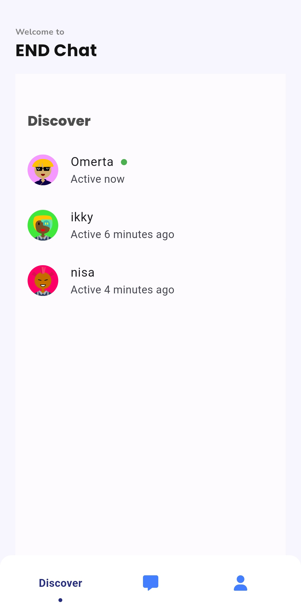
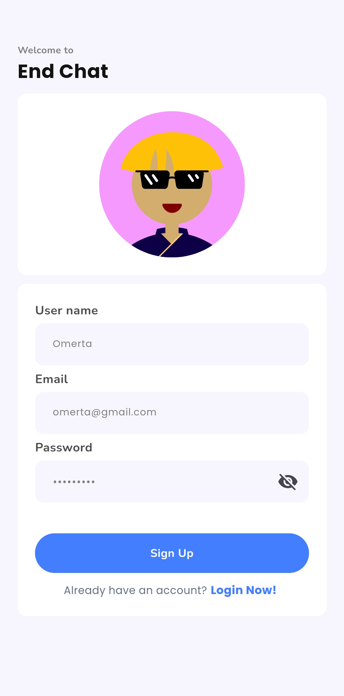

# Flutter Chat Application

A real-time chat application built with Flutter and Firebase, featuring user authentication, profile avatars, and activity tracking.


## 🚀 Features

- **Real-time Messaging**: Instant message delivery using Firebase Firestore
- **User Authentication**: Secure login/signup with Firebase Auth
- **Profile Avatars**: Auto-generated avatars based on usernames
- **User Discovery**: Browse registered users with their online status
- **Activity Tracking**: Last login time and "currently active" indicators
- **Modern UI**: Clean, intuitive chat interface with custom message bubbles

## 📱 Screenshots

| Chat Interface | User Discovery | Sign Up Screen                    |
|----------------|----------------|-----------------------------------------|
|  |  |  |

## 🛠️ Tech Stack

- **Frontend**: Flutter (Dart)
- **Backend**: Firebase
  - Authentication
  - Firestore Database
  - Real-time listeners
- **State Management**: Provider/Bloc (specify which you used)
- **UI Components**: Custom widgets with Material Design

## 🏗️ Architecture

```
lib/
├── const_config/
│   ├── color_config.dart
│   └── text_config.dart
├── models/
│   ├── message_model.dart
│   ├── test.dart
│   └── user_model.dart
├── screens/
│   ├── auth/
│   │   ├── login.dart
│   │   └── sign_up.dart
│   ├── chat/
│   │   ├── chat_tabs/
│   │   │   ├── chats.dart
│   │   │   ├── discover.dart
│   │   │   └── profile.dart
│   │   └── dashboard.dart
├── services/
│   ├── auth_services/
│   │   └── auth_setup.dart
│   ├── utils/
│   │   ├── helper_functions.dart
│   │   └── validators.dart
│   ├── chat_service.dart
│   └── user_management_services.dart
└── widgets/
    ├── custom_buttons/
    │   └── rounded_action_button.dart
    ├── input_widgets/
    │   ├── multi_line_input_field.dart
    │   ├── password_input_field.dart
    │   └── simple_input_field.dart
    └── chat_bubble.dart
```

## 📋 Prerequisites

Before running this project, make sure you have:

- Flutter SDK (version 3.0 or higher)
- Dart SDK
- Android Studio / VS Code
- Firebase account
- Android device or emulator

## ⚙️ Installation & Setup

### 1. Clone the repository
```bash
git clone https://github.com/eter-null/chat-app.git
cd chat-app
```

### 2. Install dependencies
```bash
flutter pub get
```

### 3. Firebase Configuration

1. Create a new Firebase project at [Firebase Console](https://console.firebase.google.com/)
2. Enable Authentication (Email/Password)
3. Create a Firestore database
4. Download `google-services.json` and place it in `android/app/`
5. Follow the [FlutterFire setup guide](https://firebase.flutter.dev/docs/overview)

### 4. Update Firebase configuration
```bash
dart pub global activate flutterfire_cli
flutterfire configure
```

### 5. Run the application
```bash
flutter run
```

## 🔥 Firebase Structure

### Users Collection
```javascript
users/{userId} {
  email: string,
  last_active: timestamp, 
  my_chats: {
    // nested object structure for user's chat references
  },
  name: string,
  uuid: string
}
```

### Chat Collection
```javascript
chat/{chatId} {
  message: string,
  name: string, // sender identifier
  profileAvatar: string, // used for avatar generation
  time: timestamp, 
  uuid: string // sender's user ID
}
```

| Authentication | Users Collection | Chat Collection |
|----------------|----------------|----------------|
|  |  |  |

## 🌟 Key Features Implementation

### Key Features Implementation

### Real-time Activity Tracking
- Users' `last_active` timestamp updates when they use the app
- Activity status determined by comparing `last_active` with current time
- Users collection stores individual activity data per user

### Custom Avatar Generation
- Avatars generated from `profileAvatar` field (username/initials)
- Consistent avatar display across chat messages
- `name` field used as sender identifier in chat messages

### Simplified Chat Structure
- Direct message storage in `chat` collection
- Each message contains sender info (`name`, `uuid`, `profileAvatar`)
- Timestamp stored in `time` field for chronological ordering
- User chat references managed through `my_chats` nested structure

## 🚧 Challenges Solved

1. **Real-time Status Updates**: Implemented using Firebase presence system
2. **Avatar Integration**: Modified message structure to include sender information
3. **User Discovery**: Created efficient query system for user listing
4. **UI Responsiveness**: Optimized for different screen sizes